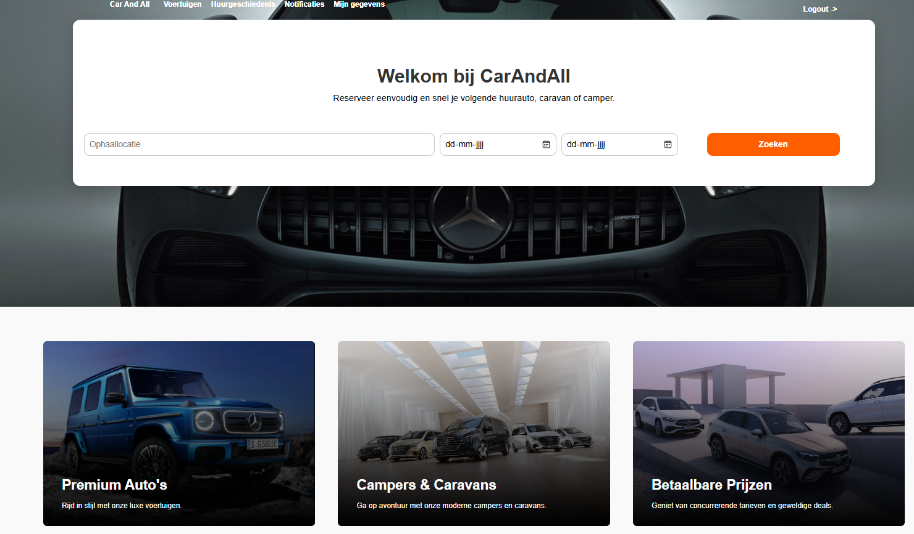
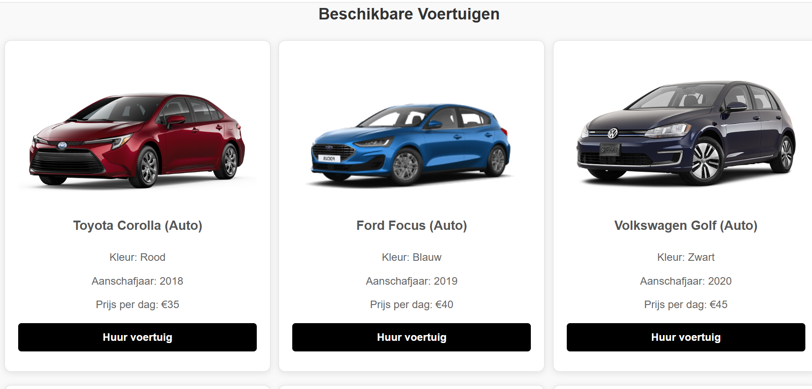
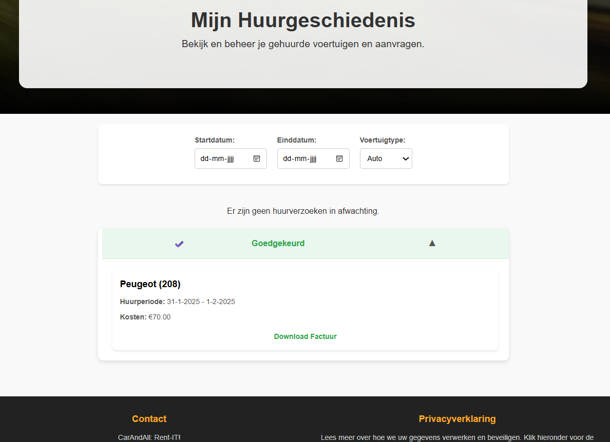

> **Note: This is a school project created for educational purposes only.**

---

# Rent-IT! — Vehicle Rental Web Application for CarAndAll

Rent-IT! is a web application developed for CarAndAll, a vehicle rental company serving both private individuals and businesses. The application automates the entire rental process, from submitting rental requests to managing subscriptions, vehicles, and damage reports, making it faster and easier for both customers and employees.
---

## Features

**For customers (private & business)**
- Register and log in as a private or business customer
- Browse and filter available vehicles by type, date and price
- Submit rental requests and track their status
- View rental history with costs and downloadable invoices
- Business customers can manage a fleet overview and subscriptions

**For CarAndAll employees**
- Backoffice staff can approve or reject rental requests and process damage reports
- Frontoffice staff can register vehicle pickup and return, including damage
- Fleet managers can add, edit, and remove vehicles from the system

---

## Tech Stack

| Layer | Technology |
|---|---|
| Frontend | React |
| Backend | ASP.NET Core (C#) |
| Authentication | ASP.NET Identity Framework + JWT |
| Database | Relational database (SQL) |
| Security | HTTPS, bcrypt password hashing, role-based authorization |
| CI/CD | GitHub (feature branches, pull requests, develop branch) |

---

## Security & Privacy

- All passwords are hashed using bcrypt
- API endpoints are protected with `[Authorize(Role=...)]` attributes
- Frontend routes are protected with a `ProtectedRoute` component
- All communication runs over HTTPS
- Compliant with GDPR (AVG): minimal data collection, transparent data usage, personal data deleted within 30 days of account closure
- Personal data is retained for a maximum of 6 months after the end of a rental period

---

## Accessibility

The application follows WCAG guidelines and implements:
- ARIA attributes for screen reader support (`aria-label`, `aria-labelledby`, `aria-live`)
- Semantic HTML (`role="article"`, proper heading structure)
- Alt text on all images
- Sufficient color contrast ratios
- Full keyboard navigation support

Accessibility was audited using **Lighthouse**.

---

## Testing

- **Backend:** Unit tests
- **Frontend:** End-to-end tests
- **Accessibility:** Lighthouse audits

---

## Project Structure (Key Roles)

| Role | Responsibilities |
|---|---|
| Private Customer | Browse vehicles, submit rental requests, view history |
| Business Customer | Same as private, plus fleet overview and subscription management |
| Backoffice Employee | Manage rental requests, damage reports, generate reports |
| Frontoffice Employee | Register vehicle pickup and return, log damage |
| Fleet Manager | Add/edit/delete vehicles, manage employee access |

---

## CI/CD Workflow

The project followed a structured Git workflow:
- A `develop` branch was created at the start
- Each team member worked in their own `feature` branch
- Pull requests were submitted at the end of each week
- Every Monday, all feature branches were merged into `develop`

---

## Screenshots

---

## Disclaimer

This project was built as part of a school assignment. It is not intended for production use.
